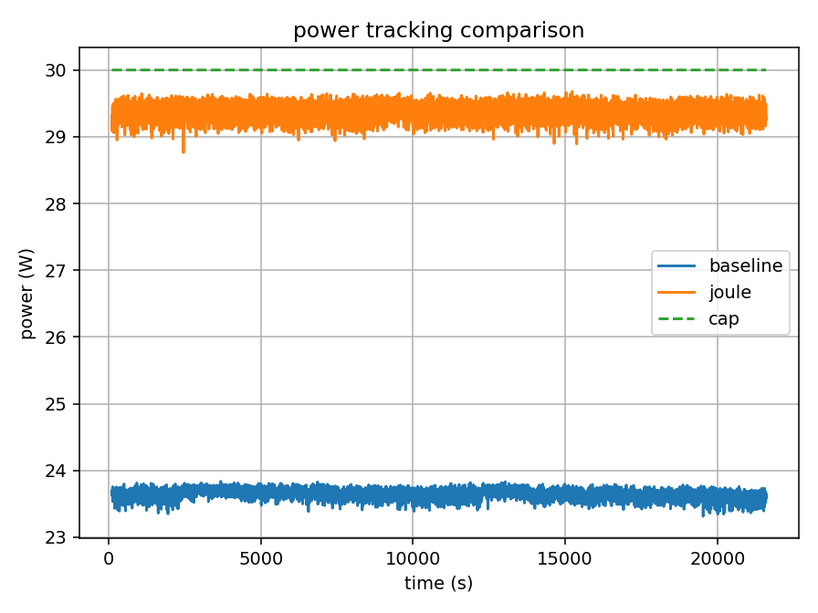

# Joule
Dynamic power envelope management for compute clusters.

Joule is a distributed control system that dynamically allocates power budgets across compute nodes while maintaining strict compliance with a global power envelope.

Modern compute infrastructure frequently operates under strict power limits imposed by datacenter facilities, rack power delivery systems, or server-level constraints.

Joule converts unused power headroom into useful compute by dynamically redistributing power budgets across nodes while maintaining strict adherence to a global power cap.

Additional details are described in the
[Joule Technical Memo](Joule_Technical_Memo.pdf).

A short overview is available in the
[Joule Slide Deck](Joule_SlideDeck.pdf).

**Key Result**

Across power caps from **20–35 W**, Joule increases power-cap utilization from approximately **80–85%** under static configurations to **>98%**, while maintaining **zero cap violations** and improving aggregate compute throughput.

By reclaiming unused power headroom, Joule converts previously wasted
electrical capacity into additional compute work.

Representative power trace comparing static power limits with Joule control.



---

## Overview

Joule treats power as a shared resource across a cluster.

Instead of assigning static limits to each node, a centralized controller continuously monitors cluster power usage and adjusts node power limits to keep the system operating near a configured power envelope.

The system consists of:

- **Joule Brain** — centralized controller implementing the control loop  
- **Node Agents** — lightweight per-node telemetry and actuation  
- **Hardware Power Interfaces** — processor power management mechanisms (e.g., RAPL on CPUs)

High-level architecture:

```text
        +----------------+
        |   Joule Brain  |
        +----------------+
            /        \
      Node Agent   Node Agent
          |             |
     Power Control  Power Control
          |             |
   Hardware Interface Hardware Interface
```

---

## Why This Matters

Power is increasingly the primary constraint in modern compute infrastructure. Datacenters frequently operate near facility-level power limits, making it difficult to increase compute capacity without expensive infrastructure upgrades.

By dynamically reallocating unused power headroom across nodes, Joule enables clusters to operate significantly closer to their configured power envelope.

In experimental evaluation, Joule improves power-cap utilization from **~80–85%** under static configurations to **>98%** while maintaining **zero cap violations**.

This effectively converts previously unused power capacity into additional computational throughput without requiring additional hardware.

---

## Project Status

Joule is currently a research prototype.

The system has been experimentally validated on a small compute cluster using sustained workloads under multiple power caps.

Future development will focus on:

* scaling to larger clusters
* GPU power interfaces
* integration with cluster schedulers
* hierarchical power envelopes

---

## Results

Initial experiments demonstrate:

* **>98% power-cap utilization**
* **0% cap violations**
* **~0.05–0.07 W power standard deviation**
* improved aggregate throughput relative to static configurations

Summary:

```
Summary (35 W cap)

Baseline
mean power: 30.232 W (86.4% utilization)
mean throughput: 3,485 H/s

Joule
mean power: 34.001 W (97.1% utilization)
mean throughput: 3,653 H/s
```
Throughput is measured as hashes per second (H/s).

---

## Key Features

* Global power envelope control (cluster cap)
* Dynamic per-node power allocation
* Marginal throughput-based allocation (lightweight probing + EMA)
* Distributed telemetry collection (per-node agents)
* Fault tolerance for stale or unreachable nodes (fail-safe power limits)
* Declarative experiment configuration using TOML
* Reproducible runs (config snapshots + logs + analysis tooling)

---

## How It Works

Joule maintains a global power envelope using a feedback controller operating on aggregate cluster power.

At each control tick:

1. Node agents report power consumption and throughput
2. The controller aggregates cluster power usage
3. If power is below the configured cap, the controller increases total allocated limit (within safety constraints)
4. If power approaches or exceeds the cap, limits are reduced to maintain compliance
5. Available power headroom is allocated preferentially to nodes with higher marginal throughput benefit

This enables tight tracking of the global power envelope while adapting continuously to workload behavior.

---

## Experiments

Joule is evaluated using paired runs under identical conditions.

### Baseline

Nodes operate under fixed/static power limits.

### Joule

The controller dynamically adjusts per-node limits while enforcing the same global cap.

Experiments are typically executed for extended durations (e.g., six hours) to capture workload variability.

---

## Metrics

Evaluation focuses on:

**Cap Utilization**

```
mean(power / cap)
```

**Tracking Error**

```
cap − power
```

**Overshoot**

```
power > cap
```

**Throughput**

Aggregate useful work completed per second.

**Throughput per Watt**

```
work / power
```

---


## Reproducibility

Each run records:

* configuration snapshot
* controller parameters
* runtime telemetry
* experiment metadata

---

## License

This project is licensed under the Apache License, Version 2.0.

See the LICENSE file for details.

---

## Citation

If you use or reference Joule, please cite:

Finn Wicks.
*Joule: Dynamic Power Envelope Management for Compute Clusters.*
Technical Memo, March 2026.

---

## Contact

For questions or collaboration inquiries:

[finn.wicks@wickstech.co.uk](mailto:finn.wicks@wickstech.co.uk)
March 2026
